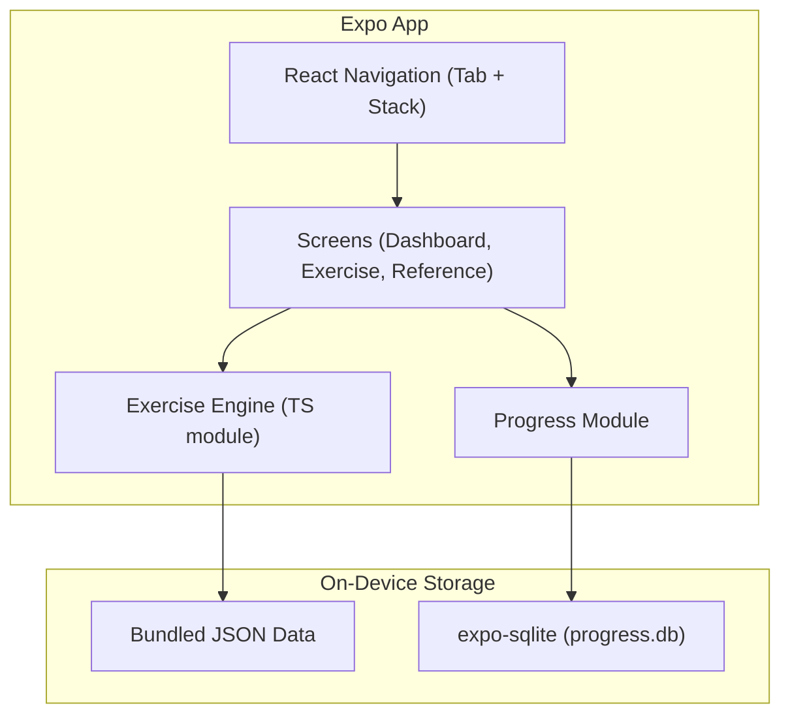
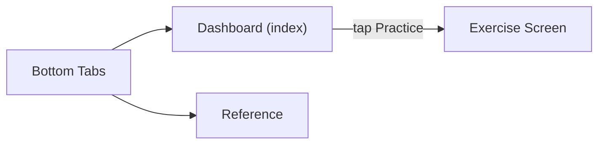

# Hungarian Learning Mobile App (iOS)

## Why Expo

- **Zero native config to start** -- run `npx create-expo-app`, then test on your iPhone via the Expo Go app immediately.
- **TypeScript** -- good autocompletion and type safety for the exercise engine logic.
- **Local-first** -- no backend server needed. Exercise data ships as bundled JSON; progress lives in on-device SQLite.
- **If you ever want Android**, the same codebase works with zero changes.

## Architecture



## Project Structure

```
hungarify/
  app/                        # Expo Router file-based routing
    (tabs)/
      _layout.tsx             # Tab navigator layout
      index.tsx               # Dashboard screen (module cards)
      reference.tsx           # Grammar reference screen
    exercise/
      [module].tsx            # Dynamic exercise screen per module
    _layout.tsx               # Root stack layout
  src/
    engine/
      index.ts                # generate_exercise(), check_answer()
      conjugation.ts          # Conjugation-specific logic
      cases.ts                # Noun case logic
      vowelHarmony.ts         # Vowel harmony logic
      wordOrder.ts            # Word order logic
      numbers.ts              # Number/date/time logic
    data/
      conjugation.json        # Verb stems, conjugation tables
      cases.json              # Nouns, case suffix mappings
      vowelHarmony.json       # Words with harmony classifications
      wordOrder.json          # Sentence pairs and orderings
      numbers.json            # Number-word mappings, time patterns
    db/
      progress.ts             # SQLite schema, record attempts, query stats
    components/
      ModuleCard.tsx           # Dashboard card for each module
      MultipleChoice.tsx       # Tappable option buttons
      FillInBlank.tsx          # Text input exercise component
      WordSorter.tsx           # Draggable word reordering
      FeedbackBanner.tsx       # Correct/incorrect + explanation
    theme.ts                   # Colors, typography, spacing constants
  app.json                     # Expo config
  package.json
  tsconfig.json
  README.md
```

## Navigation

Using **Expo Router** (file-based routing built on React Navigation):

- **Bottom tabs**: Dashboard | Reference
- **Stack push**: Tapping "Practice" on a module card pushes `exercise/[module]` onto the stack with a back button.



## Five Practice Modules

Same content as the web plan, adapted for touch interaction:

### 1. Verb Conjugation

- **Exercises**: Multiple choice (tap the correct conjugated form) and fill-in-the-blank (keyboard input).
- **Data**: `src/data/conjugation.json` -- common verbs with stems; `src/engine/conjugation.ts` applies regular rules programmatically, stores irregular forms explicitly.

### 2. Noun Cases and Suffixes

- **Exercises**: Multiple choice (pick the correctly suffixed noun) and fill-in-the-blank.
- **Data**: `src/data/cases.json` -- nouns by vowel class with suffix mappings per case.

### 3. Vowel Harmony

- **Exercises**: Classify a word's harmony group (tap back/front-rounded/front-unrounded); pick the correct suffix variant from a pair.
- **Data**: `src/data/vowelHarmony.json` -- word list with harmony labels.

### 4. Word Order

- **Exercises**: **Draggable word tiles** -- rearrange scrambled words into the correct Hungarian sentence. Uses a `WordSorter` component with drag-to-reorder.
- **Data**: `src/data/wordOrder.json` -- sentence pairs with correct orderings and focus explanations.

### 5. Numbers, Dates, and Time

- **Exercises**: Type the Hungarian word for a displayed numeral; multiple choice for time/date expressions.
- **Data**: `src/data/numbers.json` -- number-word mappings, time patterns.

## Exercise Engine (`src/engine/`)

- `index.ts` exports `generateExercise(module, difficulty)` and `checkAnswer(exercise, userAnswer)`.
- Each module has its own file (e.g., `conjugation.ts`) with module-specific generation logic.
- Returns a typed `Exercise` object: `{ id, type, prompt, options?, correctAnswer, explanation }`.
- Difficulty tiers (beginner / intermediate / advanced) control item selection and distractor count.

## Progress Tracking (`src/db/progress.ts`)

- Uses **expo-sqlite** for a local SQLite database.
- Schema: `attempts(id INTEGER PRIMARY KEY, module TEXT, exercise_key TEXT, correct INTEGER, timestamp TEXT)`.
- Exposes: `recordAttempt()`, `getModuleStats()` (accuracy %, attempt count), `getStreak()`.
- Dashboard reads stats to display accuracy percentage and attempt count on each module card.

## UI Design

- **Dashboard**: Scrollable list of five `ModuleCard` components, each showing module name, short description, accuracy ring/percentage, and a "Practice" button. Clean layout with Hungarian-flag-inspired accent colors (red, white, green) used sparingly on interactive elements.
- **Exercise screen**: Adapts based on exercise type -- `MultipleChoice` shows tappable option pills, `FillInBlank` shows a text input with on-screen keyboard, `WordSorter` shows draggable word tiles. A `FeedbackBanner` slides in after submission showing correct/incorrect with the explanation.
- **Reference screen**: Scrollable grammar tables organized by module (collapsible sections).
- **Theme**: System fonts, consistent spacing via `theme.ts`, supports light mode, safe-area aware.

## Key Dependencies

- `expo` -- managed workflow runtime
- `expo-router` -- file-based navigation
- `expo-sqlite` -- local SQLite access
- `react-native-reanimated` + `react-native-gesture-handler` -- smooth drag-to-reorder in WordSorter

## Key Decisions

- **Expo managed workflow** -- no need to eject or configure Xcode. Test via Expo Go app on your iPhone.
- **All data bundled locally** -- no network calls, works offline, instant responses.
- **expo-sqlite over AsyncStorage** -- structured queries make progress stats trivial to compute.
- **No external APIs or LLMs** -- deterministic, rule-based exercise logic.

## Implementation Steps

1. Scaffold Expo project with expo-router, install dependencies, configure app.json and tsconfig
2. Set up theme.ts (colors, typography, spacing) and navigation layout (tabs + stack)
3. Create the five JSON data files with curated Hungarian exercise content
4. Implement src/engine/ -- exercise generation and answer checking for all five modules
5. Implement src/db/progress.ts -- SQLite schema, recordAttempt, getModuleStats, getStreak
6. Build reusable components: ModuleCard, MultipleChoice, FillInBlank, WordSorter, FeedbackBanner
7. Build screens: Dashboard (index.tsx), Exercise ([module].tsx), Reference (reference.tsx)
8. End-to-end testing on iOS simulator / Expo Go, fix bugs, polish animations and layout
