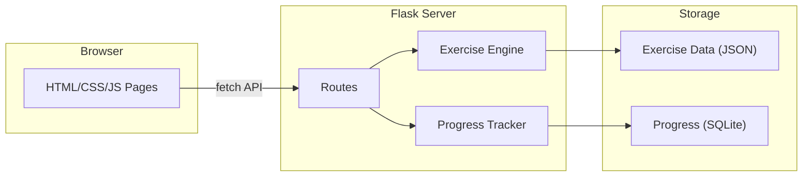

# Hungarian Learning Web App

## Architecture

A single-process **Flask** app with a vanilla HTML/CSS/JS frontend. No heavy JS framework needed -- we'll use fetch calls for submitting answers and getting instant feedback, keeping the experience snappy.



## Project Structure

```
hungarify/
  app.py                  # Flask app, routes, entry point
  engine.py               # Exercise generation & answer checking logic
  progress.py             # SQLite-backed progress tracking
  models.py               # Data classes for exercises, results
  data/
    conjugation.json      # Verb stems, conjugation tables
    cases.json            # Noun stems, case suffix rules
    vowel_harmony.json    # Root words, suffix options, harmony rules
    word_order.json       # Sentence fragments & correct orderings
    numbers.json          # Number words, date/time patterns
  static/
    style.css             # Global styles (modern, clean design)
    app.js                # Client-side logic (fetch, UI updates)
  templates/
    base.html             # Shared layout (nav, footer)
    dashboard.html        # Landing page with module cards
    exercise.html         # Universal exercise view
    reference.html        # Cheat-sheet / grammar reference
  requirements.txt
  README.md
```

## Five Practice Modules

Each module has its own JSON data file and generates exercises through `engine.py`.

### 1. Verb Conjugation

- **What it covers**: Present, past, and conditional tenses; definite vs. indefinite conjugation across all six persons (en, te, o/on, mi, ti, ok/ek/ok).
- **Exercise types**: (a) Given an infinitive + person + tense + definiteness, fill in the correct conjugated form. (b) Multiple choice picking the right conjugation.
- **Data**: `data/conjugation.json` -- a list of common verbs with stems and irregularity flags; the engine applies regular conjugation rules programmatically and stores irregular forms explicitly.

### 2. Noun Cases and Suffixes

- **What it covers**: The major Hungarian cases -- inessive (-ban/-ben), dative (-nak/-nek), elative (-bol/-bol), illative (-ba/-be), superessive (-on/-en/-on), sublative (-ra/-re), instrumental (-val/-vel), and others.
- **Exercise types**: (a) Given a noun + target case, supply the correctly suffixed form. (b) Given a sentence with a blank, pick the right suffixed noun.
- **Data**: `data/cases.json` -- nouns categorized by vowel class, with suffix mapping per case.

### 3. Vowel Harmony

- **What it covers**: Classifying words as back-vowel, front-vowel (rounded), or front-vowel (unrounded); choosing the correct suffix variant.
- **Exercise types**: (a) Classify a word's vowel harmony group. (b) Given a word and a suffix pair (e.g., -ban/-ben), pick the correct one.
- **Data**: `data/vowel_harmony.json` -- word list with harmony class labels and practice suffix pairs.

### 4. Word Order

- **What it covers**: Hungarian topic-focus-verb structure; neutral vs. focused sentences; negation placement.
- **Exercise types**: (a) Rearrange scrambled words into a correct Hungarian sentence. (b) Given an English sentence and Hungarian words, build the correct order.
- **Data**: `data/word_order.json` -- sentence pairs (English + Hungarian words + correct ordering + explanation of focus).

### 5. Numbers, Dates, and Time

- **What it covers**: Cardinal and ordinal numbers, telling time, dates.
- **Exercise types**: (a) Given a numeral (e.g., 47), type the Hungarian word. (b) Given a time (e.g., 3:30), produce the Hungarian phrase. (c) Multiple choice for date formats.
- **Data**: `data/numbers.json` -- number-word mappings, time patterns, date vocabulary.

## Exercise Engine (`engine.py`)

- A single `generate_exercise(module, difficulty)` function loads the relevant JSON, picks a random item, and returns an exercise dict with `prompt`, `options` (if multiple choice), `correct_answer`, and `explanation`.
- A `check_answer(exercise_id, user_answer)` function validates the response and returns feedback.
- Difficulty tiers (beginner / intermediate / advanced) control which items are eligible and how many distractors appear.

## Progress Tracking (`progress.py`)

- SQLite database (`progress.db`) with a simple schema:
  - `attempts(id, module, exercise_key, correct, timestamp)`
- Dashboard queries this to show: accuracy per module, streak count, and a simple "mastery" percentage per module.
- No user auth needed (single-user local app).

## Frontend Design

- **Dashboard**: Five cards (one per module) showing the module name, a short description, current accuracy %, and a "Practice" button. Clean grid layout, muted color palette with Hungarian-flag-inspired accent colors (red/white/green used sparingly).
- **Exercise view**: A single `exercise.html` template that adapts to the exercise type -- shows a prompt, input field or clickable options, a submit button, and a feedback area that reveals correct/incorrect + explanation.
- **Reference page**: Concise grammar tables for each module (conjugation charts, case suffix table, vowel harmony rules) so the user can study before or during practice.
- CSS uses system fonts, a max-width container, and responsive design. No framework dependencies.

## Key Decisions

- **No external APIs or LLMs** -- all exercise logic is deterministic and rule-based, so it works offline and is fully predictable.
- **JSON data files** rather than a database for exercise content -- easy to hand-edit and extend.
- **Single-user, local-first** -- no auth, no server deployment needed. Just `flask run`.

## Implementation Steps

1. Scaffold project structure, `requirements.txt`, `README.md`, and Flask app skeleton
2. Create the five JSON data files with curated Hungarian exercise content
3. Implement `engine.py` -- exercise generation and answer checking for all five modules
4. Implement `progress.py` -- SQLite schema, recording attempts, querying stats
5. Wire up Flask routes: dashboard, exercise API (GET exercise, POST answer), reference page
6. Build HTML templates: base layout, dashboard with module cards, exercise view, reference page
7. Write `static/style.css` and `static/app.js` for styling and interactive exercise flow
8. End-to-end testing, fix bugs, polish UI, ensure all modules work correctly
